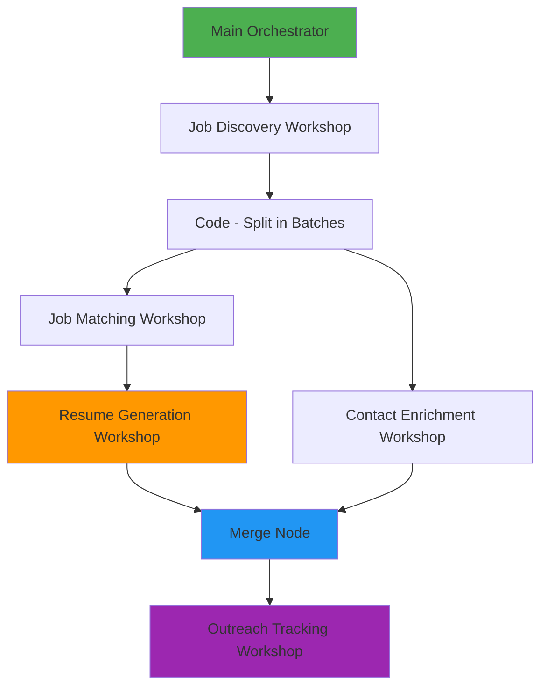

# Resume Attachment Data Flow Diagram

**Date**: 2025-10-01  
**Purpose**: Visual representation of resume data flow from generation to Gmail attachment

---

## 🔄 COMPLETE DATA FLOW ARCHITECTURE



---

## 📊 CURRENT STATE (BEFORE FIX)

### **Resume Generation Workshop Output**:
```json
{
  "jobData": {...},
  "resumeGeneration": {
    "customizedResume": "Full resume TEXT...",  // ⚠️ TEXT FORMAT
    "atsScore": 95,
    "relevanceScore": 88
  }
}
```

### **Merge Node Output** (Passed to Outreach Tracking):
```json
{
  "contactRecord": {
    "jobTitle": "Ecommerce Copywriter",
    "companyName": "Tharp Ventures",
    "recepientEmail": "markus.fischer@tharpventures.com",
    ...
  },
  "resumeGeneration": {
    "customizedResume": "Full resume TEXT...",  // ✅ DATA IS HERE
    "atsScore": 95
  }
}
```

### **Outreach Tracking Input Processing** (CURRENT - BROKEN):
```javascript
// ❌ PROBLEM: Does NOT extract resumeGeneration data
const contactRecord = inputData.contactRecord || {};
const resumeContent = contactRecord.content || '';  // ❌ WRONG SOURCE

// Result: Resume data is LOST
```

### **Draft Gmail Node** (CURRENT - BROKEN):
```json
{
  "options": {
    "attachmentsUi": {
      "attachmentsBinary": [
        {}  // ❌ EMPTY - NO ATTACHMENT
      ]
    }
  }
}
```

**Result**: ❌ No resume attachment in Gmail draft

---

## 🎯 PROPOSED SOLUTION (AFTER FIX)

### **Step 1: Enhanced Input Processing**
```javascript
// ✅ FIXED: Extract resumeGeneration data from merged input
const contactRecord = inputData.contactRecord || {};
const resumeGeneration = inputData.resumeGeneration || {};  // NEW

// Extract resume content from correct source
const resumeContent = resumeGeneration.customizedResume || contactRecord.content || '';
const resumeAtsScore = resumeGeneration.atsScore || 0;
```

### **Step 2: Add Google Drive Node**
```
AI Email Generation
    ↓
Fetch Resume from Google Drive  // NEW NODE
    ↓ (binary.data)
Resume Filename Customizer  // NEW NODE
    ↓ (binary.resume)
Draft Gmail
```

### **Step 3: Resume Filename Customizer**
```javascript
// Input: binary.data from Google Drive
// Output: binary.resume with dynamic filename

const filename = `Resume_IvoDachev_${cleanJobTitle}_${cleanCompanyName}.pdf`;

return {
  json: $json,
  binary: {
    resume: {
      data: binaryData.data,
      fileName: filename,
      mimeType: 'application/pdf'
    }
  }
};
```

### **Step 4: Updated Draft Gmail Node**
```json
{
  "options": {
    "attachmentsUi": {
      "attachmentsBinary": [
        {
          "property": "resume"  // ✅ References binary.resume
        }
      ]
    },
    "sendTo": "={{ $('Outreach Input Processing').item.json.contact.email }}"
  }
}
```

**Result**: ✅ Gmail draft has resume attachment with dynamic filename

---

## 🔍 DETAILED DATA FLOW (AFTER FIX)

### **Phase 1: Resume Generation** (Unchanged)
```
Job Matching Workshop
    ↓ (jobData + jobAnalysis)
Resume Generation Workshop
    ↓
AI Resume Customization
    ↓
Quality Gate Filter
    ↓
Resume Generation Output Formatting
    ↓ OUTPUT:
{
  "resumeGeneration": {
    "customizedResume": "Full resume TEXT...",
    "atsScore": 95,
    "relevanceScore": 88
  }
}
```

### **Phase 2: Merge in Orchestrator** (Unchanged)
```
Resume Generation Workshop → Merge (Input 0)
Contact Enrichment Workshop → Merge (Input 1)
    ↓
Merge Node combines both inputs
    ↓ OUTPUT:
{
  "contactRecord": {...},
  "resumeGeneration": {...}  // ✅ PRESERVED
}
```

### **Phase 3: Outreach Tracking** (MODIFIED)
```
Execute Workflow Trigger
    ↓ (receives merged data)
Outreach Input Processing (MODIFIED)
    ↓ (extracts resumeGeneration.customizedResume)
If - Duplicate or not
    ├── TRUE → Merge (skip email)
    └── FALSE → AI Email Generation
                    ↓
                Fetch Resume from Google Drive (NEW)
                    ↓ (binary.data)
                Resume Filename Customizer (NEW)
                    ↓ (binary.resume with dynamic filename)
                Draft Gmail (MODIFIED)
                    ↓ (creates draft with attachment)
                Merge
    ↓
Status Update
```

---

## 📋 DATA STRUCTURE AT EACH STAGE

### **Stage 1: Resume Generation Workshop Output**
```json
{
  "jobData": {
    "title": "Ecommerce Copywriter",
    "company": "Tharp Ventures",
    "location": "Remote",
    "description": "..."
  },
  "resumeGeneration": {
    "customizedResume": "# Ivo Dachev\nSacramento, CA...",
    "atsScore": 95,
    "relevanceScore": 88,
    "qualityPassed": true,
    "customizationSummary": {...},
    "recommendedActions": [...]
  },
  "processingMetadata": {...}
}
```

### **Stage 2: Merge Node Output (to Outreach Tracking)**
```json
{
  "contactRecord": {
    "jobTitle": "Ecommerce Copywriter",
    "companyName": "Tharp Ventures",
    "recepientEmail": "markus.fischer@tharpventures.com",
    "contactName": "Markus Fischer",
    "dedupeKey": "Tharp Ventures|Ecommerce Copywriter",
    "status": "PREPARED",
    ...
  },
  "resumeGeneration": {
    "customizedResume": "# Ivo Dachev\nSacramento, CA...",
    "atsScore": 95,
    "relevanceScore": 88,
    "qualityPassed": true
  }
}
```

### **Stage 3: Outreach Input Processing Output (AFTER FIX)**
```json
{
  "job": {
    "title": "Ecommerce Copywriter",
    "company": "Tharp Ventures",
    ...
  },
  "contact": {
    "name": "Markus Fischer",
    "email": "markus.fischer@tharpventures.com",
    ...
  },
  "resume": {
    "customizedContent": "# Ivo Dachev\nSacramento, CA...",  // ✅ FROM resumeGeneration
    "matchScore": 95,  // ✅ FROM resumeGeneration.atsScore
    "qualificationScore": 88,  // ✅ FROM resumeGeneration.relevanceScore
    "atsScore": 95,
    "relevanceScore": 88,
    "qualityPassed": true
  },
  ...
}
```

### **Stage 4: Google Drive Node Output**
```json
{
  "json": {...},
  "binary": {
    "data": {
      "data": "base64_encoded_pdf_content...",
      "mimeType": "application/pdf",
      "fileName": "Ivo Dachev Resume.pdf",
      "fileExtension": "pdf"
    }
  }
}
```

### **Stage 5: Resume Filename Customizer Output**
```json
{
  "json": {...},
  "binary": {
    "resume": {
      "data": "base64_encoded_pdf_content...",
      "mimeType": "application/pdf",
      "fileName": "Resume_IvoDachev_Ecommerce_Copywriter_Tharp_Ventures.pdf",  // ✅ DYNAMIC
      "fileExtension": "pdf"
    }
  }
}
```

### **Stage 6: Draft Gmail Node**
```
Creates Gmail draft with:
- To: markus.fischer@tharpventures.com
- Subject: Application for Ecommerce Copywriter - Ivo Dachev
- Body: [Full personalized email]
- Attachments: Resume_IvoDachev_Ecommerce_Copywriter_Tharp_Ventures.pdf  // ✅ ATTACHED
```

---

## 🎯 KEY INSIGHTS

### **Why Resume Data Was Lost**:
1. ✅ Resume Generation Workshop **DOES** generate resume text
2. ✅ Merge Node **DOES** combine Resume + Contact data
3. ❌ Outreach Input Processing **DOES NOT** extract `resumeGeneration` field
4. ❌ Result: Resume data exists in input but is never used

### **Why Attachment Didn't Work**:
1. ❌ No binary data source (no Google Drive node)
2. ❌ No PDF conversion (resume is TEXT, not BINARY)
3. ❌ Empty attachment configuration (`{}` instead of `{"property": "resume"}`)

### **How the Fix Works**:
1. ✅ Extract `resumeGeneration` data in Input Processing
2. ✅ Fetch static resume PDF from Google Drive
3. ✅ Rename binary data with dynamic filename
4. ✅ Configure Draft Gmail to use `binary.resume` property
5. ✅ Result: Gmail draft has resume attachment

---

## 🚀 IMPLEMENTATION SUMMARY

**Changes Required**: 4 modifications
1. **Update**: Outreach Input Processing Code node (extract resumeGeneration)
2. **Add**: Fetch Resume from Google Drive node
3. **Add**: Resume Filename Customizer Code node
4. **Update**: Draft Gmail node (attachment configuration)

**Estimated Time**: 15-20 minutes  
**Complexity**: Medium  
**Risk**: Low (no changes to Resume Generation or Orchestrator)

---

**Diagram Complete** ✅  
**Ready for Implementation** 🚀

