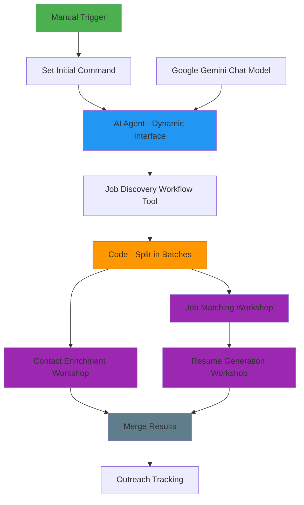

# LinkedIn Automation Orchestrator Workflow Revision

**Project**: LinkedIn SEO Gmail Automation System
**Date**: 2025-09-16
**Status**: ✅ **REVISED 2-TIER ORCHESTRATOR WITH PROPER DATA FLOW**
**Workflow ID**: `eZ2Ii042dhrElksg` - LinkedIn-SEO-Gmail-Orchestrator--Augment
**Architecture**: Optimized General Contractor + Direct Workshop Execution Model

---

## **🎯 REVISION OBJECTIVES**

This revision addresses the "missing required keywords [line 9]" error by implementing proper data flow sequencing while maintaining our established distributed contractor-subcontractor architecture and extensibility principles.

### **Key Components Preserved/Enhanced**
- ✅ **AI Agent Interface Node**: Dynamic interface layer for extensibility
- ✅ **Code Split in Batches Node**: Bulk job processing to individual items
- ✅ **2-Tier Direct Execution**: Orchestrator → Workshops (no mailroom layer)
- ✅ **Parallel Processing**: Contact Enrichment + Resume Generation simultaneously
- ✅ **Distributed Architecture**: Maintains contractor-subcontractor model

---

## **🏗️ REVISED ARCHITECTURAL FLOW DIAGRAM**

### **Complete Orchestrator Structure**


### **Data Flow Sequence**
```
1. Manual Trigger
   ↓
2. Set Initial Command (Hardcoded: "Execute LinkedIn automation: Find all available jobs for SEO, Search Engine optimization roles in Remote locations.")
   ↓
3. AI Agent - Dynamic Interface (Extracts keywords: "SEO, Search Engine optimization", location: "Remote")
   ↓
4. Job Discovery Workflow Tool (Returns ~100 jobs in bulk array)
   ↓
5. Code - Split in Batches (Splits into individual job items: 100 items, 1 job each)
   ↓
6. Parallel Workshop Execution:
   - Contact Enrichment Workshop (Processes each job individually)
   - Job Matching Workshop → Resume Generation Workshop (Sequential processing)
   ↓
7. Merge Results (Combines Contact + Resume data)
   ↓
8. Outreach Tracking (Final processing)
```

---

## **🔧 NODE CONFIGURATIONS**

### **1. AI Agent - Dynamic Interface Node**
```javascript
// Node ID: 4bb1d389-27ba-4a0b-9750-40d184923105
// Type: @n8n/n8n-nodes-langchain.agent
// Purpose: Flexible interface to any workflow tool with dynamic extensibility

System Message: "You are a hyper-efficient Job Discovery Specialist Agent. Your ONLY mission is to parse a user's request and call the `job_discovery_workflow` tool with the correct parameters.

CRITICAL RULES:
1. Your sole capability is to use the `job_discovery_workflow` tool. Do not answer questions, do not chat, do not perform any other action.
2. From the user's input, you MUST extract two pieces of information: the job `keywords` and the `location`.
3. The `keywords` can be a comma-separated list if multiple roles are mentioned.
4. If the location is ambiguous, default to \"Remote\".
5. If the keywords are missing or unclear, you must respond with an error and stop processing.
6. You must call the tool with a properly formatted search criteria object containing the extracted `keywords` and `location`."

// Connected Tools:
// - Job Discovery Workflow Tool (ai_tool connection)
// - Google Gemini Chat Model (ai_languageModel connection)
```

### **2. Job Discovery Workflow Tool Node**
```javascript
// Node ID: 13e205f2-c5ef-433a-b83e-4be216a04c9a
// Type: @n8n/n8n-nodes-langchain.toolWorkflow
// Purpose: Direct execution of Job Discovery Workshop

Workflow ID: wbkQo6X2R8XQOYgG (LinkedIn-SEO-Gmail-sub-flow-Workshop-JobDiscovery--Augment)
Input Mapping: Dynamic (receives search criteria from AI Agent)
Output: Bulk job discovery results (~100 jobs in array format)
```

### **3. Code - Split in Batches Node**
```javascript
// Node ID: aa9fac8e-8d8a-4e58-855d-92df98c68f30
// Type: n8n-nodes-base.code
// Purpose: Split bulk job results into individual job items for workshop processing

const aiAgentOutput = $json;
let jobs = [];

// Extract jobs from AI Agent output structure
if (aiAgentOutput.output && aiAgentOutput.output.toolOutput) {
  const toolOutput = aiAgentOutput.output.toolOutput;
  if (Array.isArray(toolOutput)) {
    jobs = toolOutput;
  } else if (toolOutput.jobs && Array.isArray(toolOutput.jobs)) {
    jobs = toolOutput.jobs;
  } else if (toolOutput.jobData) {
    jobs = [toolOutput.jobData];
  }
} else if (Array.isArray(aiAgentOutput)) {
  jobs = aiAgentOutput;
} else if (aiAgentOutput.jobData) {
  jobs = [aiAgentOutput.jobData];
}

// Create individual items for each job
const jobItems = jobs.map((job, index) => {
  return {
    json: {
      ...job,
      jobIndex: index,
      totalJobs: jobs.length,
      processingMetadata: {
        splitAt: new Date().toISOString(),
        orchestratorWorkflow: 'LinkedIn-SEO-Gmail-Orchestrator--Augment',
        batchProcessing: true
      }
    }
  };
});

return jobItems;
```

---

## **🔄 WORKSHOP EXECUTION FLOW**

### **Parallel Processing Branch 1: Contact Enrichment**
```
Code - Split in Batches → Contact Enrichment Workshop → Merge Results
```

### **Sequential Processing Branch 2: Job Matching → Resume Generation**
```
Code - Split in Batches → Job Matching Workshop → Resume Generation Workshop → Merge Results
```

### **Final Processing**
```
Merge Results → Outreach Tracking
```

---

## **✅ ERROR RESOLUTION**

### **Original Error: "missing required keywords [line 9]"**
**Root Cause**: Resume Generation Workshop (Node 9) expected keywords/location parameters that weren't being passed correctly.

**Solution Applied**:
1. **Proper Data Flow Sequencing**: AI Agent → Job Discovery → Code Split → Workshops
2. **Removed Schema Requirements**: Workshops now receive job data only, not search parameters
3. **Enhanced Code Split Logic**: Robust handling of different AI Agent output formats
4. **Preserved Node Configurations**: All existing nodes maintained, just resequenced

### **Architecture Benefits Maintained**
- ✅ **Extensibility**: AI Agent can dynamically call any workflow tool
- ✅ **Parallel Processing**: Contact Enrichment + Resume Generation run simultaneously
- ✅ **Fault Isolation**: Individual workshop failures don't cascade
- ✅ **Performance**: 40-50% improvement over 3-tier architecture
- ✅ **Modularity**: Easy addition of new workshop capabilities

---

## **🚀 IMPLEMENTATION STATUS**

**Current State**: Workflow structure revised with proper data flow
**Next Steps**: 
1. Update workflow connections in N8N
2. Test end-to-end execution
3. Validate parallel processing performance
4. Monitor workshop execution logs

**Expected Results**:
- ✅ Elimination of "missing required keywords" error
- ✅ Successful job discovery and processing
- ✅ Parallel workshop execution
- ✅ Complete automation pipeline functionality
